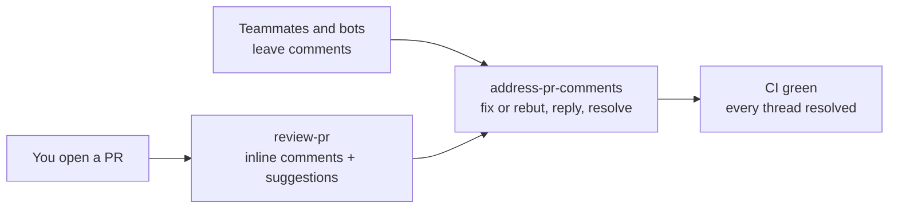
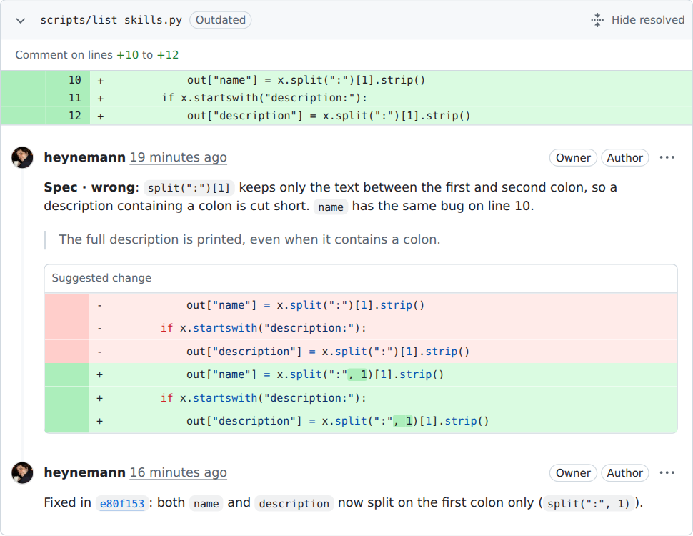
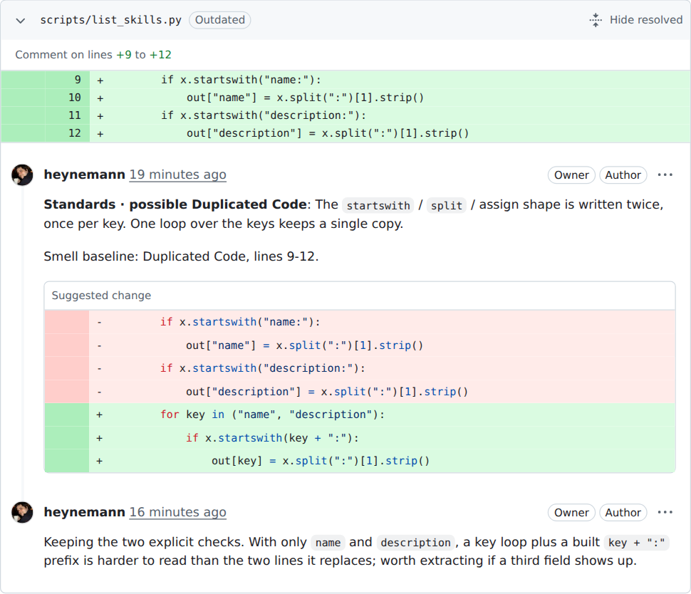

# Skills that finish the job

[](LICENSE)
[](#install)
[](https://github.com/vercel-labs/skills)

**Agent skills for the part of the job after "it compiles": reviewing the pull
request, answering the review, getting CI green, and building services that
come out the same way every time.**

I'm Bernardo, and these are the skills I run every day. Each one owns one job
from start to finish and leaves evidence you can click: comments on the exact
line, commits linked from every reply, threads that end resolved.

```bash
npx skills add heynemann/skills
```

## Your PR, reviewed and answered by your agent

Open a pull request and say *"review PR 42"*. `review-pr` reads it the way a
careful senior engineer would: does it follow this repo's standards, and does
it actually do what the PR says it does? Every finding lands as an inline
comment on the line it's about, usually with a suggested change you can commit
in one click.

Then say *"address the comments on PR 42"*. `address-pr-comments` takes the
other chair. It fixes what's right, one commit per comment, and replies
`Fixed in <commit>`. It argues back, with evidence, when a comment is wrong.
It fixes red CI at the source. Every thread ends resolved.



Here's a real round trip from [PR #1](https://github.com/heynemann/skills/pull/1),
where both skills ran on a deliberately flawed script. `review-pr` flagged a
spec violation with a suggested fix; `address-pr-comments` fixed it and linked
the commit:



## The skills

| Skill | Say this | What happens |
| --- | --- | --- |
| [**review-pr**](docs/review-pr.md) | "Review PR 42" | Checks the PR against your repo's standards and its own description, then posts the findings as inline comments with suggested changes. |
| [**address-pr-comments**](docs/address-pr-comments.md) | "Address the comments on this PR" | Fixes failing checks, fixes or rebuts every comment, pushes one commit per fix, replies in each thread and resolves it. |
| [**go-http-api**](docs/go-http-api.md) | "Scaffold a Go API for tasks" | Builds a Go HTTP service on one proven stack: OpenAPI first, one module per feature, tests, Docker and a verification gate. |

Install just the one you want:

```bash
npx skills add heynemann/skills --skill review-pr            # inline PR reviews
npx skills add heynemann/skills --skill address-pr-comments  # answer the review, get CI green
npx skills add heynemann/skills --skill go-http-api          # opinionated Go HTTP services
```

## Why these exist

### Review bots live somewhere else

Hosted reviewers are good at catching things, but they run on someone else's
servers with someone else's idea of your conventions. `review-pr` runs inside
your agent with your `gh` login. It reads *your* `CONTRIBUTING.md` and
`AGENTS.md`, and checks the code against what the PR claims to do. Findings it
can't prove are labelled as judgement calls ("possible Feature Envy"), not
passed off as rules.

### Addressing a review is death by a thousand round trips

Read the comment, find the line, fix it, commit, push, go back, reply, resolve,
repeat, while CI fails for an unrelated reason. `address-pr-comments` does the
whole loop. It also knows when to say no: a comment that's wrong gets a short
rebuttal with evidence, in its thread, instead of a silent change.



### Every new service is a snowflake

Ask an agent for a Go API twice and you get two architectures. `go-http-api`
pins one stack (Fiber v3, fx, GORM/PostgreSQL, Redis, Prometheus,
OpenTelemetry), one layout and a verification gate. Every service it builds
looks like the last one, and none of them is done until the gate passes.

## Install

The [skills CLI](https://github.com/vercel-labs/skills) installs into Claude
Code, Codex, Cursor, OpenCode and 70+ other agents.

```bash
npx skills add heynemann/skills --list                # see what's here
npx skills add heynemann/skills                       # pick interactively
npx skills add heynemann/skills --skill '*'           # take everything
npx skills add heynemann/skills -g -a claude-code     # for your user, one agent
```

What each skill needs:

- **review-pr** and **address-pr-comments**: the
  [GitHub CLI](https://cli.github.com/), logged in with `gh auth login`.
  `review-pr` also needs `python3`.
- **go-http-api**: Go, Docker and Node (for the pinned code generators).

## Contributing

New skills are welcome. [RULES.md](RULES.md) has the checklist: a `SKILL.md`, a
page in [`docs/`](docs/) and a row in the table above. Markdown is linted on
commit; turn the hook on once per clone:

```bash
git config core.hooksPath .githooks    # needs markdownlint-cli: brew install markdownlint-cli
```

## License

[MIT](LICENSE). `review-pr` builds on
[mattpocock/skills](https://github.com/mattpocock/skills) (MIT); see its
[NOTICE](skills/review-pr/NOTICE).
