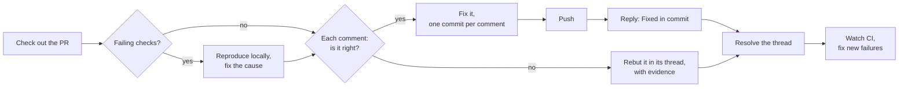

# address-pr-comments

**Hand your agent a PR full of review comments and red checks. Get it back
green, with every comment answered in its own thread.**

Addressing a review is a loop of tiny chores: find the line, fix it, commit,
push, go back, reply, resolve, and again for the next one, while CI fails for
some other reason. `address-pr-comments` runs the whole loop. It fixes what's
right, pushes back with evidence on what isn't, and leaves a trail you can
click through.


## Try it

```bash
npx skills add heynemann/skills --skill address-pr-comments
```

Then, from a checkout of the repository:

```text
Address the comments on PR 42.
```

```text
Address the PR comments on this branch.
```

With no number, it works on the PR of your current branch, and asks for a
number when the branch has none.

## What it does



- **Red checks get fixed at the source.** It reads the failing log, reproduces
  the failure locally and fixes the cause.
- **Each comment gets a verdict.** If the reviewer is right, it fixes it in its
  own commit. If the reviewer is wrong or out of scope, it replies with why,
  citing the code, a test or a doc.
- **Replies go where the comment is.** Review threads get a reply in the thread
  and are resolved. Top-level comments get a quote-reply, and the original is
  minimized as resolved, since GitHub can't resolve those.
- **CI is watched after the push**, and new failures are fixed for up to three
  rounds.
- **You get a report in chat** listing every comment's outcome and anything
  still open.

Not every comment deserves a yes. Here's one it turned down, politely and with
a reason:


## Ground rules it keeps

- **Never force-pushes**, and stops if you have uncommitted changes rather
  than stashing your work.
- **Never makes CI green the cheap way**: no skipped or deleted tests,
  `--no-verify`, `continue-on-error`, loosened lint rules or lowered
  thresholds.
- **Never edits your PR description** or posts one big catch-all comment.
- **Doesn't reply to comments that ask for nothing**, like approvals, praise
  or bot status reports. It lists them in the report instead.

## Requirements

- The [GitHub CLI](https://cli.github.com/), logged in (`gh auth login`), with
  push access to the PR's branch.

## FAQ

**Does it ask before posting?** No. It runs from start to finish so you can
walk away. Every action is a reply or a commit you can review afterwards.

**What if a check fails because of something outside the repo**, like an
expired secret or a runner outage? It reruns the check once, and if it still
fails, reports it instead of "fixing" code that isn't broken.

**What about comments I left myself?** They're skipped. It answers other
people's comments, not yours.

**Where do the comments come from?** Anyone: teammates, review bots, or
[review-pr](review-pr.md).
