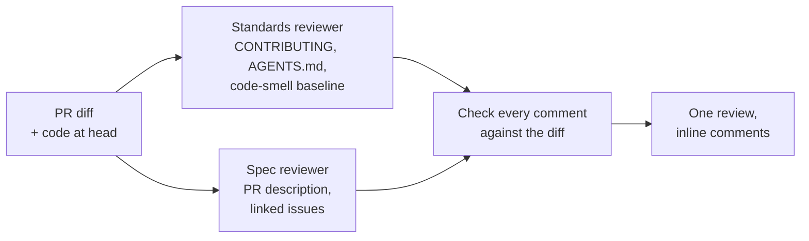

# review-pr

**A code review that lands where reviews belong: as inline comments on the
lines your pull request changed.**

`review-pr` reads a PR the way a careful senior engineer would and asks two
separate questions. Does the code follow *this repo's* standards? Does it do
what the PR says it does? Each finding is posted on its line, labelled so you
can tell a broken rule from a judgement call, usually with a suggested change
you can commit from GitHub in one click.


*From [PR #1](https://github.com/heynemann/skills/pull/1): the PR description
said descriptions containing a colon must print in full; the code cut them
short.*

## Try it

```bash
npx skills add heynemann/skills --skill review-pr
```

Then, from a checkout of the repository:

```text
Review PR 42.
```

```text
Review the PR for this branch.
```

With no number, it reviews the PR of your current branch, and asks for a
number when the branch has none.

## What you get

One GitHub review, posted as a comment (it never approves or blocks):

- **An inline comment per finding**, on the exact changed line, each with a
  label:

  | Label | Means |
  | --- | --- |
  | `Standards · violation` | Breaks a rule your repo documents; the comment links the rule. |
  | `Standards · possible <smell>` | A judgement call, e.g. *possible Feature Envy*. Your standards override it. |
  | `Spec · missing` | The PR description or linked issue asked for something that isn't there. |
  | `Spec · scope creep` | The diff does something nobody asked for. |
  | `Spec · wrong` | It's implemented, but not the way the spec says. |

- **Suggested changes** you can commit from GitHub. Each one is checked to
  leave the file working when committed on its own.
- **A two-line summary**: findings and the worst issue per axis, plus anything
  that couldn't be pinned to a changed line.

## How it works



1. **Finds the PR** and pins its diff, numbering every line GitHub accepts a
   comment on.
2. **Gathers the rules**: your `CONTRIBUTING.md`, `AGENTS.md`, `CLAUDE.md`,
   style guides, plus a baseline of Fowler code smells that your own rules
   always override.
3. **Gathers the spec**: the PR description, the issues it closes or
   references, and any matching spec file.
4. **Runs two reviewers in parallel**, one per question, so a clean style pass
   can't hide a wrong feature (and the reverse).
5. **Checks every comment against the diff** before posting, because GitHub
   rejects the whole review if a single comment points at the wrong line.

## What it won't do

- Approve, request changes, or block a merge. Every review is a `COMMENT`.
- Repeat a finding that's already been raised on the same lines.
- Nitpick what your linter, formatter, type checker or CI already enforce.
- Pass off a hunch as a rule: smells are always labelled *possible*.

## Requirements

- The [GitHub CLI](https://cli.github.com/), logged in (`gh auth login`).
- `python3`, for the bundled diff checker.

## FAQ

**What if my repo has no written standards?** The code-smell baseline still
applies, and every smell is labelled as a judgement call.

**What if the PR has no description?** The Spec review is skipped, and the
summary says so.

**Can I run it on my own PR?** Yes. That's a good way to catch things before
your teammates do.

**What happens next?** Hand the comments to
[address-pr-comments](address-pr-comments.md), which fixes or rebuts each one
and resolves the threads.

---

Built on Matt Pocock's two-axis
[`code-review`](https://github.com/mattpocock/skills/tree/main/skills/engineering/code-review)
skill (MIT), which reports in chat; `review-pr` posts to GitHub instead.
